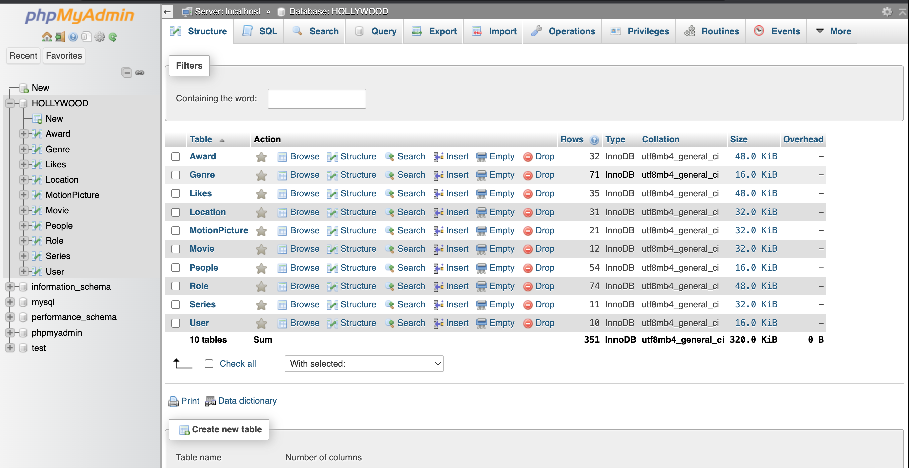
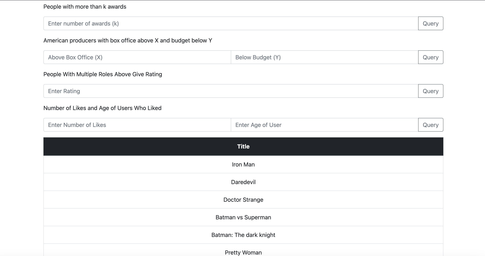
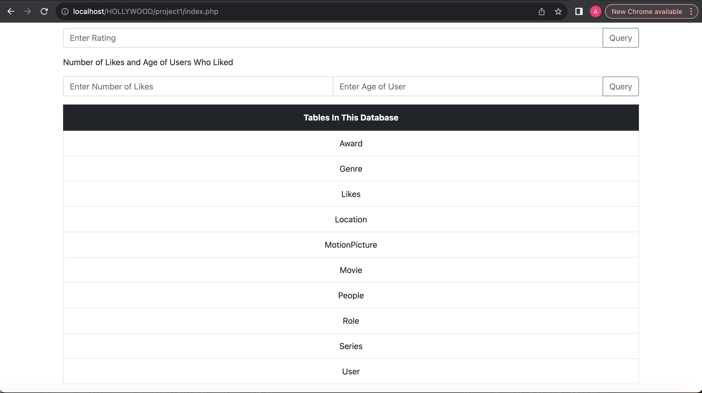
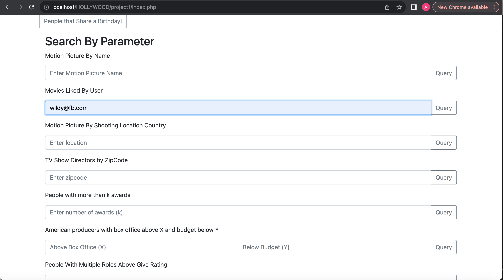
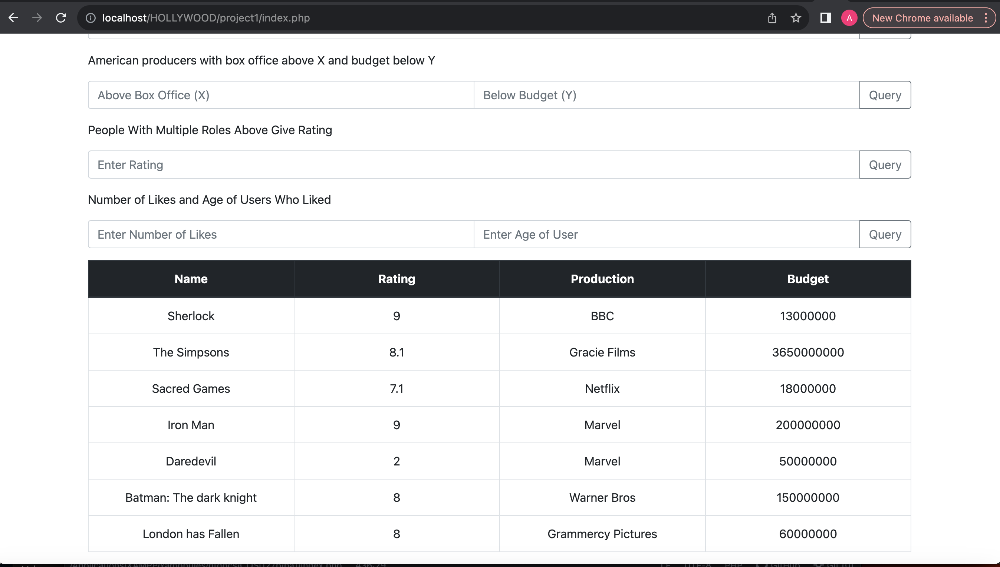

# hollywood-sql-ui
A basic UI for an SQL database surrounding movies, actors, et cetera. 

## Uses
This basic UI allows the user to sort and filter by various specific attributes, both through buttons as well as query by specific parameters. 
## Tools
The Hollywood Database UI was created using myPHPAdmin and XAMPP. 

## A Basic Run Through
After starting mySQL Database, ProFTPD, and Apache Web Server through XAMPP (for my it is using manager-osx), I searched the path in my htdocs folder to index.php.

There are buttons available for pre-set queries, but there are also fields where users can type specific parameters to search by. These are not always practically useful at the moment, but more an exerscice into using the database and specific SQL queries combined with a UI.

