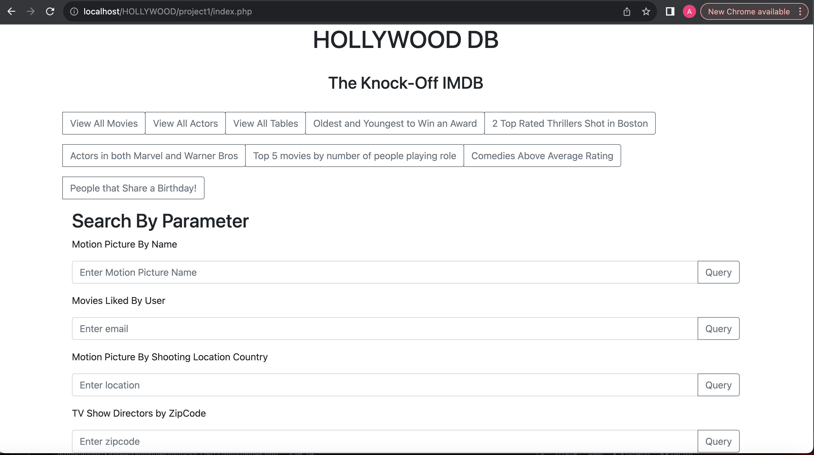

# hollywood-sql-ui
A basic UI for an SQL database surrounding movies, actors, et cetera. 

## Uses
This basic UI allows the user to sort and filter by various specific attributes, both through buttons as well as query by specific parameters. 
## Tools
The Hollywood Database UI was created using myPHPAdmin and XAMPP. 

## Schema

## A Basic Run Through

